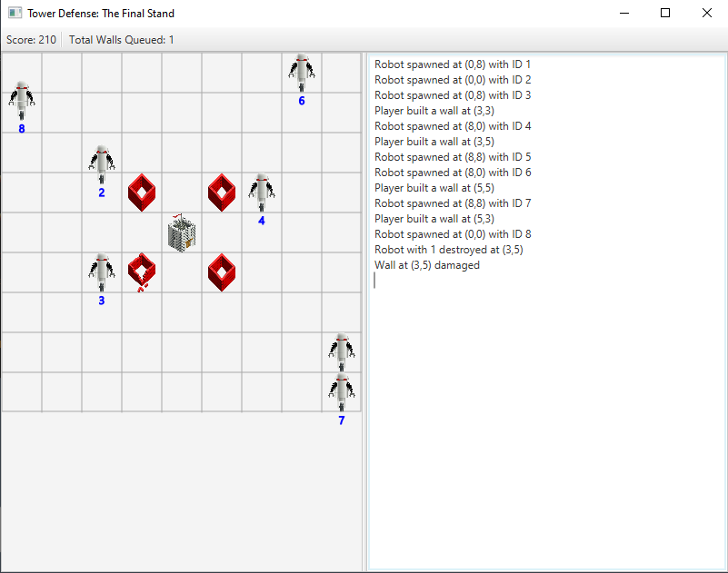
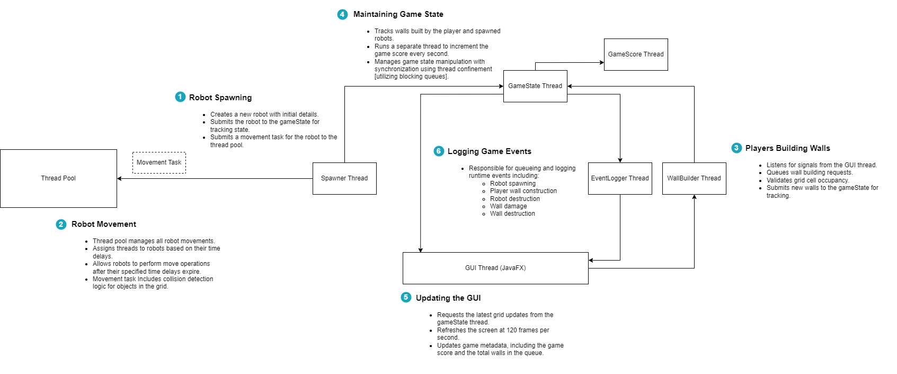

# Tower Defense Game

## Instructions

Your job is to defend the citadel from robots trying to destroy it by building walls around it. The robots will attack the walls, and the first hit damages them, while the second hit destroys them. You can build a maximum of 10 walls on the grid simultaneously. The first wall is built instantly, and each subsequent wall takes 2 seconds to build. You can still click on the grid square where you want to build a wall and queue it up. After the 2-second delay, the wall will be built automatically.

## How to run

Run the following commands: `./grldlew run`

## Program Architecture

Here is a diagram illustrating the program architecture. Diagram may not be clear therefore you may need to click on it and download as a raw file 😬.

<small>
Note: This program was part created as part of a university assessment. If you use any section of the code for a similar project, it is your responsibility to cite the source for those code portions to avoid plagiarism so that you don't get into trouble :)
</small>
